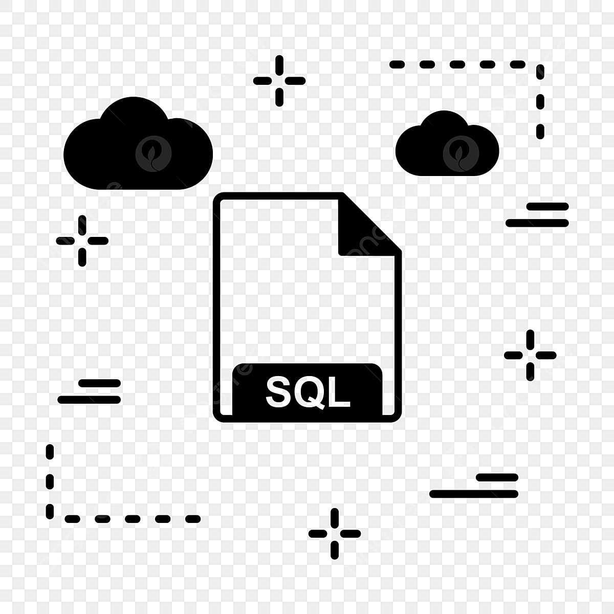
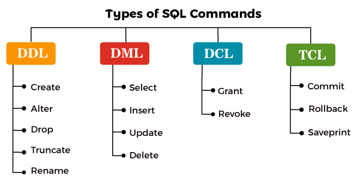

# Hello Guys Welcome to the SQL tutorial

### In this tutorial You can also prepare the SQL Interview (Non relational Database)

### Note: You always give exact point answer. Don't explain too much. Make sure your answer would be short and match the answer.





## What is Database ?

### A database is an organized collection of logically related data that contains information relevent to an enterprise.

## What is DBMS(Database Management System) ?
### A DBMS is the set of programs that is used to store, retrieve and manipulate the data in convenient and efficient and way. Main goal of DBMS is to the hide underlying complexities of data management from users and provide easy interface to them.
### It's a software that manages databases and provides an interface for users to interact with them.


### And What is RDBMS(Relational Database Management System) ???
#### RDBMS is a Database management system that store and organized data in table rows and columns, efficient data retrieval and manipulation through structured queries. They are widely used in application requiring structured and consistent data storage, such as business systems and web applications, such as business systems and web application.


### Did you heard about NoSQL ? Then What are the difference between NOSQL vs SQL ?

```
SQL 
1. SQL is used for structured data
2. SQL is schema-based
3. SQL uses the SQL query lanuage to retrieve data
4. Vertical Scaling 
5. Strong data consistency and integrity

NoSQL
1. NoSQL is used for unstructured or semi-structured data
2. NoSQL are schema-less
3. NoSQL uses a Query API or scripting language.
4. Horizontal scaling
5. Data consistency and integrity may vary depending on the type of database
```


### Types of SQL command 


