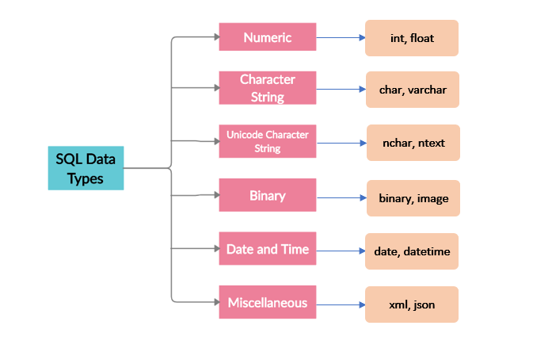

# Hello Guys Welcome to the SQL tutorial

### In this tutorial You can also prepare the SQL Interview (Non relational Database)

### Note: You always give exact point answer. Don't explain too much. Make sure your answer would be short and match the answer.


## What is Database ?

### A database is an organized collection of logically related data that contains information relevent to an enterprise.

## What is DBMS(Database Management System) ?
### A DBMS is the set of programs that is used to store, retrieve and manipulate the data in convenient and efficient and way. Main goal of DBMS is to the hide underlying complexities of data management from users and provide easy interface to them.
### It's a software that manages databases and provides an interface for users to interact with them.


### And What is RDBMS(Relational Database Management System) ???
#### RDBMS is a Database management system that store and organized data in table rows and columns, efficient data retrieval and manipulation through structured queries. They are widely used in application requiring structured and consistent data storage, such as business systems and web applications, such as business systems and web application.


### Did you heard about NoSQL ? Then What are the difference between NOSQL vs SQL ?

```
SQL 
1. SQL is used for structured data
2. SQL is schema-based
3. SQL uses the SQL query lanuage to retrieve data
4. Vertical Scaling 
5. Strong data consistency and integrity

NoSQL
1. NoSQL is used for unstructured or semi-structured data
2. NoSQL are schema-less
3. NoSQL uses a Query API or scripting language.
4. Horizontal scaling
5. Data consistency and integrity may vary depending on the type of database
```


### Types of SQL command 


## How to create database ?
```
CREATE DATABASE <database_name>;
``` 

## How to Create a table ?
```
CREATE TABLE <table name> (
    <column name> <data type>,
    .... more column
    );

    For example 
    CREATE TABLE student(id int, name varchar);
```

## How to insert data in database ?
```
INSERT INTO <table name>(columns names separated by comma ) VALUES (<values>);
For Example: INSERT INTO students values('1','<NAME>');
```

### Data types in SQL 
###  Data types are like other programming laguages that means the type of data. haha simple In SQL there are several types of Data type. The mainly used.
```
   1. Numeric 
        => INT (Integar): Represents whole numbers, typically 32-bit or 64-bit integers.
        => FLOAT (Float): Represents floating-point numbers with single-precision or double-precision accuracy.
    
    2. Charater String 
        => CHAR(n):  Fixed-length character string with a specified length n.
        => VARCHAR(n):  Variable-length character string with a maximum length of n.
        => TEXT: Variable-length character string with no specific length limit.7
    
    3. Date and Time
        => DATE:  Represents a date (year, month, day).
        => TIMESTAMP: Represents a combination of date and time.
        => DATETIME: Similar to TIMESTAMP, represents a combination of date and time.
        => INTERVAL: Represents a time interval or duration.

    4. Boolean Type
        BOOLEAN or BOOL: Represents a true or false value.
    
    5. Binary Data 
        => BINARY(n): Fixed-length binary data with a specified length n.
        => VARBINARY(n): Variable-length binary data with a maximum length of n.
        => BLOB: Binary large object, used for storing large binary data such as images or documents.
    
    6. Enumerated
        => ENUM: Represents a set of predefined values.

    7. JSON 
        => JSON: Represents JSON (JavaScript Object Notation) data.
        => JSONB: Represents binary JSON data, offering more efficient storage and indexing compared to JSON.

```

### Here Picture to Quickly understand.

;